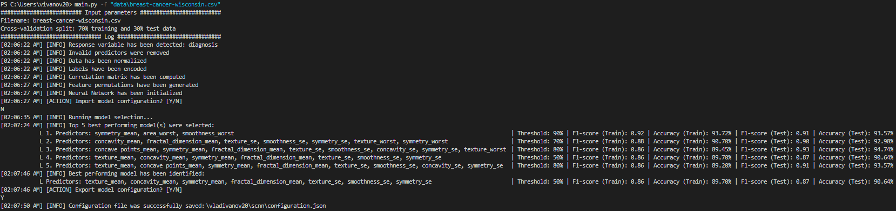

# ML From Scratch: Self-Configuring Neural Network 



Features:

* Automated data cleaning, transformation, and feature selection processes
* Feedforward Neural Network with highest performance model and decision threshold selection
* F1 score and accuracy metrics for the training and testing performance evaluation
* No dependencies
* More in the future!

Usage 

* Provide a dataset and get a working model in under 2 minutes:

```bash
$ git clone https://github.com/vladivanov20/scnn.git
$ cd scnn
$ python3 main.py -f "data/breast-cancer-wisconsin.csv"
```
